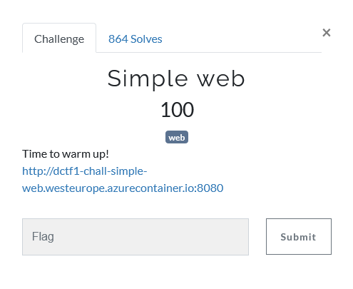
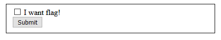
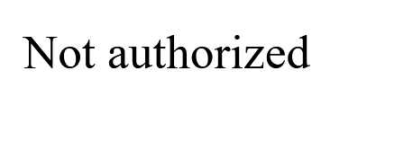
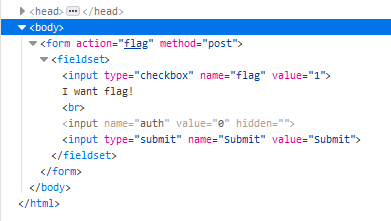
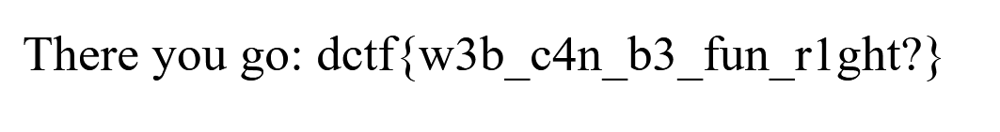

## Description

## Solution

After open the URL given, we can see this on the webpage itself.

When we check the **I want flag** checkbox and click submit, we will get this output.

We are not authorized. Guess we need to somehow get it through.

By using DevTools (F12 on the web browser), we can see something like this.

We can see there is a hidden input where **auth** is set as 0 as default. We need to change it to 1 and check the checkbox again and click submit.

