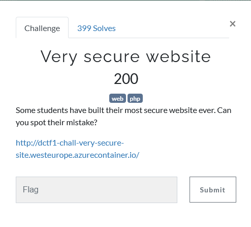
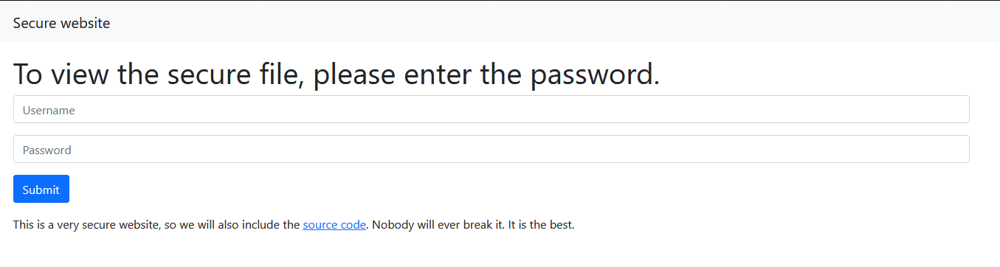
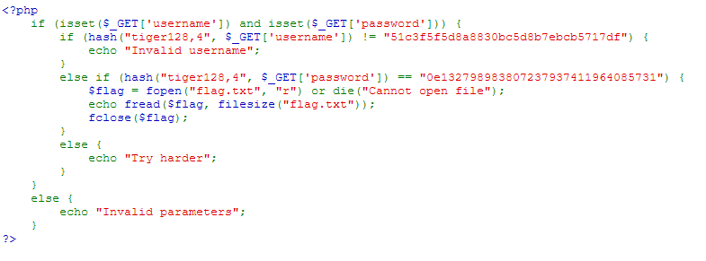
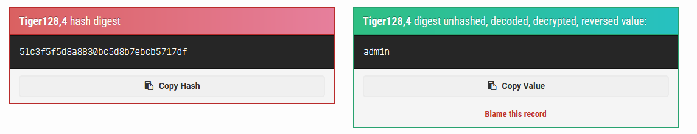
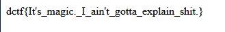

## Description

## Solution

We got this form after visiting the URL

We can see here is the php source code of the website.

We knew this vulnerability as this is a [Type Juggling](https://www.php.net/manual/en/language.types.type-juggling.php) vulnerability. The $GET['password'] is compare with the hash  where it is loose comparison rather than 3 `=` which is strict comparison.

First, we decrypt the hash at the username first

The username is **admin**

For the password, we can search for [magic hashes](https://www.whitehatsec.com/blog/magic-hashes/) and we can find the magic hashes of tiger 128,4 which is `479763000`

After supplying both of the input, then we will get the flag.

