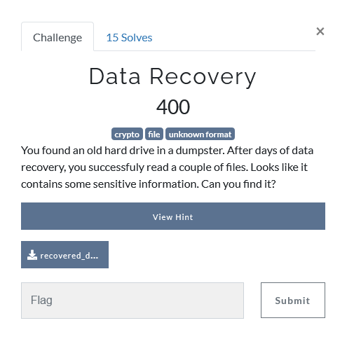
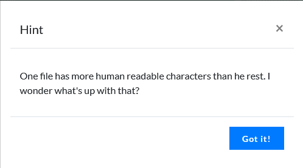
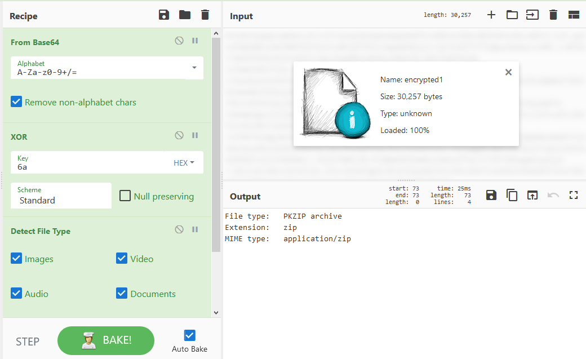
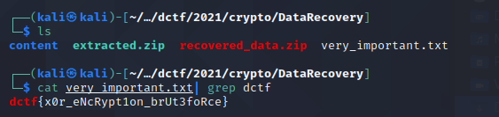

## Description

## Hint

## Solution

We can unzip the downloaded file. Then, we actually can ignore all the image, video, audio, documents files.

There is a file called **encrypted1** that is really suspicious.

We put it in [cyberchef](https://gchq.github.io/CyberChef) and decrypt it using base64, then we put magic function to brute force all the possibility of the encryption. Turns out it is XOR of **6a**

Download the output file and unzip it.

we will get a text file called **very_important.txt** contains tons of string

grep the file and we will get the flag.

