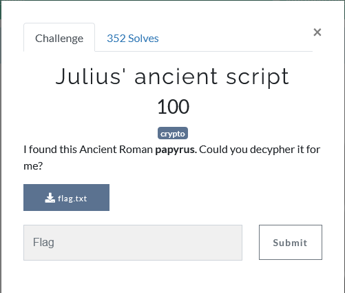
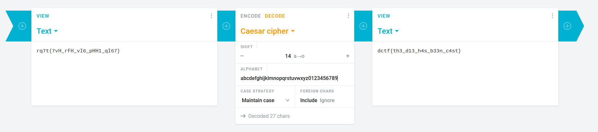

## Description

---

## Solution

After download the file and open it we will get a encrypted string

`rq7t{7vH_rFH_vI6_pHH1_qI67}`

From the title itself, we knew that it is Caesar cipher.

Notice that the cipher contains number, we need to put number at the alphabet so that it can shift the numbers too to get the flag. Hence, we can use [Cryptii](https://cryptii.com/) to decode the cipher.

