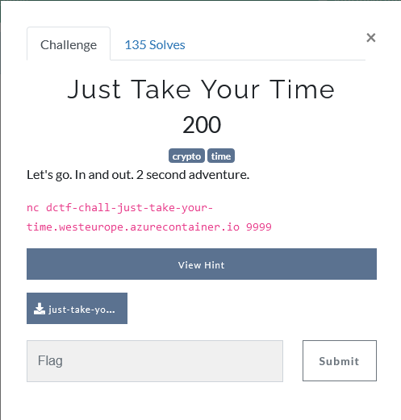
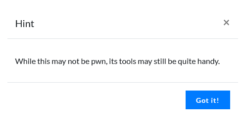
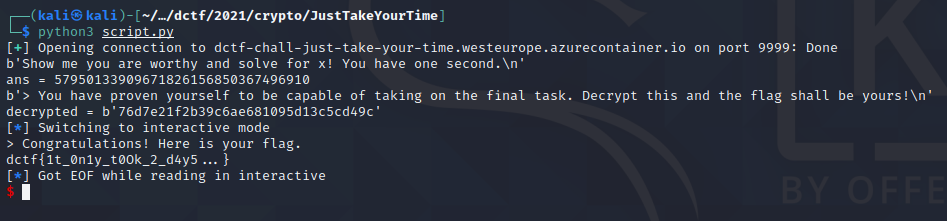

## Description
<p align="center">

</p>

## Hint
<p align="center">

</p>


## Solution

After download the file, we got a file that contains these code.

```Python
#!/usr/bin python3

from flag import flag
from Crypto.Cipher import DES3
from time import time
from random import randint
from secrets import token_hex
from pytimedinput import timedInput

guess = 3
TIMEOUT = 1

a = randint(1000000000000000, 9999999999999999)
b = randint(1000000000000000, 9999999999999999)

print("Show me you are worthy and solve for x! You have one second.")
print("{} * {} = ".format(a, b))

answ, _ = timedInput("> ", timeOut = 1, forcedTimeout = True)

try:
    assert(a*b == int(answ))
except:
    print("You are not worthy!")
    exit(1)

key = str(int(time())).zfill(16).encode("utf-8")
secret = token_hex(16)
cipher = DES3.new(key, DES3.MODE_CFB, b"00000000")
encrypted = cipher.encrypt(secret.encode("utf-8"))
print("You have proven yourself to be capable of taking on the final task. Decrypt this and the flag shall be yours!")
print(encrypted.hex())

start_time = time()
while(time() - start_time < TIMEOUT and guess > 0):
    delta = time() - start_time
    answ, _ = timedInput("> ", timeOut = TIMEOUT + 1 - delta, forcedTimeout = True)

    try:
        assert(secret == answ)
        break
    except:
        if answ != "":
            guess -= 1
            if (guess != 1):
                print("You are wrong. {} guesses remain.".format(guess))
            else:
                print("You are wrong. {} guess remains.".format(guess))

if (secret != answ):
    print("You have been unsuccessful in your quest for the flag.")
else:
    print("Congratulations! Here is your flag.")
    print(flag)

```

From the code we can see that we need to solve the prompted multiplication question and 1 second. After that, a encrypted string will be prompted and also need to solve it in 1 second. 

Solution is pretty simple, we can just copy the original code and make some tweaks and we will get the flag. 

```Python
from pwn import *
from Crypto.Cipher import DES3
from time import time
from pytimedinput import timedInput
from binascii import unhexlify

host ="dctf-chall-just-take-your-time.westeurope.azurecontainer.io"
port= 9999

r = remote(host,port)

print(r.recvline())
s = r.recvline().decode("utf-8")
num = s[0:-4]
num1 = str(num).partition("*")[0].strip()
num2 = str(num).partition("*")[2].strip()

ans = int(num1) * int(num2)
print("ans = " + str(ans))

r.sendline(str.encode(str(ans)))
print(r.recvline())

encrypted = r.recvline().strip().decode("utf-8")

key = str(int(time())).zfill(16).encode("utf-8")
cipher = DES3.new(key, DES3.MODE_CFB, b"00000000")
decrypted = cipher.decrypt(bytes.fromhex(encrypted))

print("decrypted = " + str(decrypted))

r.sendline(decrypted)

r.interactive()
```

As we can see from the code above, we first solve the math question by multiply those 2 numbers.

After that, we can just copy the original code and change the word **encrypt** to **decrypt** and the argument for the decrypt is `bytes.fromhex(encryptedString)` because we want to convert the hex to bytes before sending it to the server.

<p align="center">

</p>

yay, got the flag but I forgot to convert the hex to bytes and I stuck for so long :)