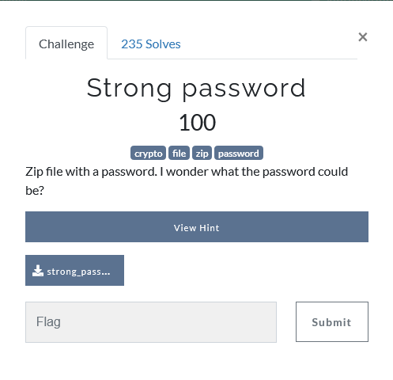
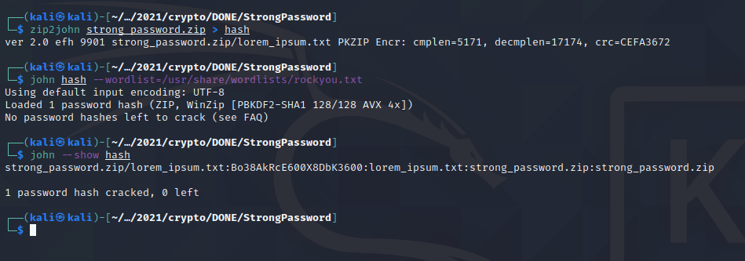
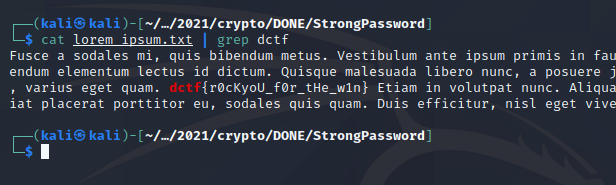

## Description

## Hint

## Solution
After download the zip file, if we try to unzip it, it needs a password to unzip the file.

Since we already been hint that do not use [fcrackzip](https://github.com/hyc/fcrackzip) to solve the challenge so we can get rid of this method

What we can do is to convert the zip password to hash and crack it using [John The Ripper](https://en.wikipedia.org/wiki/John_the_Ripper)

The password for the zip file is `Bo38AkRcE600X8DbK3600`

unzip the file using the password and we will get a `lorem_ipsum.txt`. Simply grep the file using `grep` and we will get the flag

