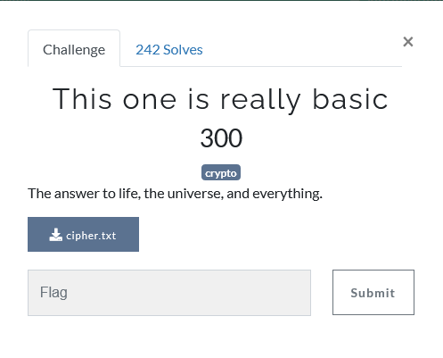
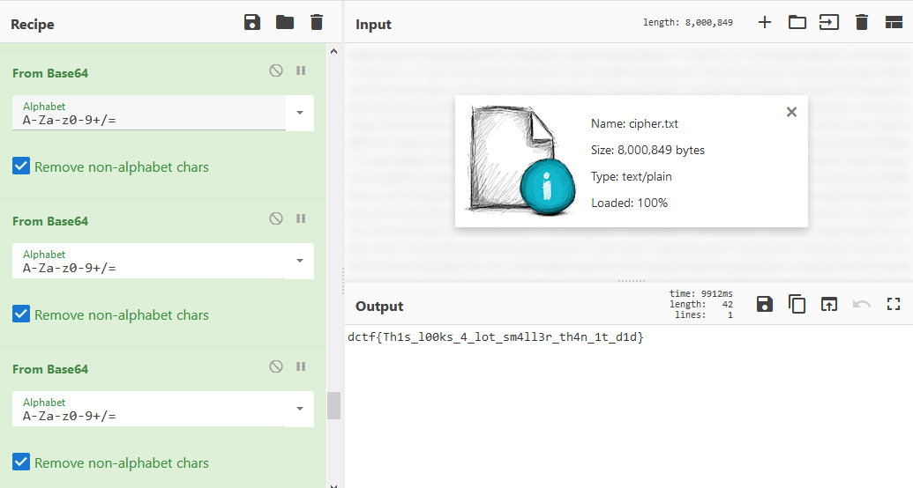

## Description

## Solution
After download the file, we will get a very long cipher text.
We can just input the cipher text file to [cyberchef](https://gchq.github.io/CyberChef/)

The decoder will automatically detect the encryption type which is base64 and we need to keep using base64 until we got the flag 
> Total of 42 times of From Base64 function added to the Recipe tab

