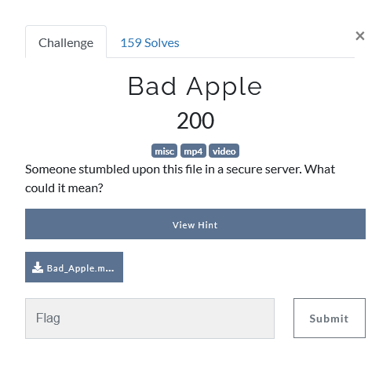
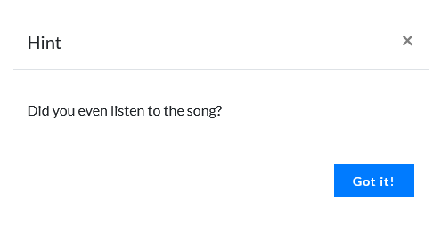
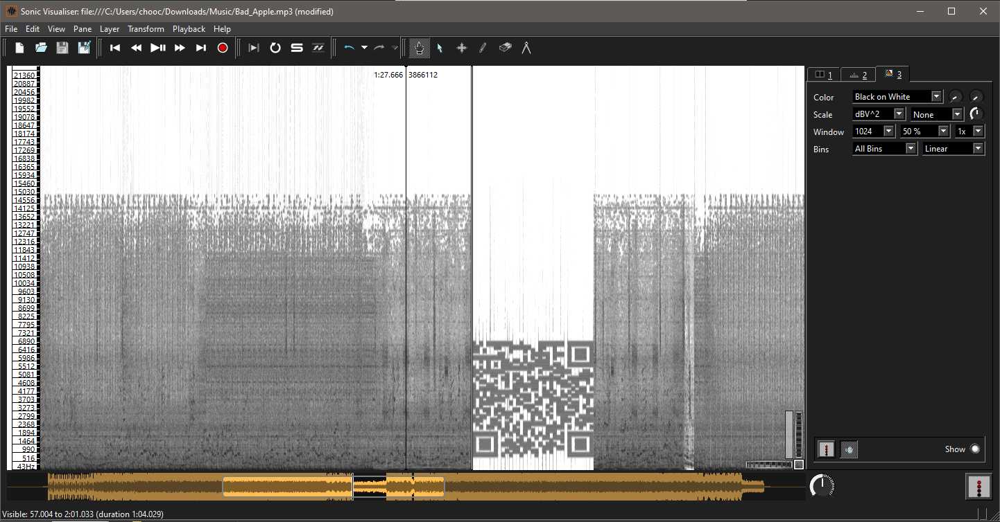

## Description

## Hint

## Solution

After download the mp4 file, we will hear some weird noise around 1:33 to 1:45

What we can do is convert the mp4 file to mp3

Then put it in [Audacity](https://www.audacityteam.org/) or [Sonic Visualizer](https://www.sonicvisualiser.org/).

After that switch to spectogram view.

Got a QR code, scan it and grab that flag and submit it :P