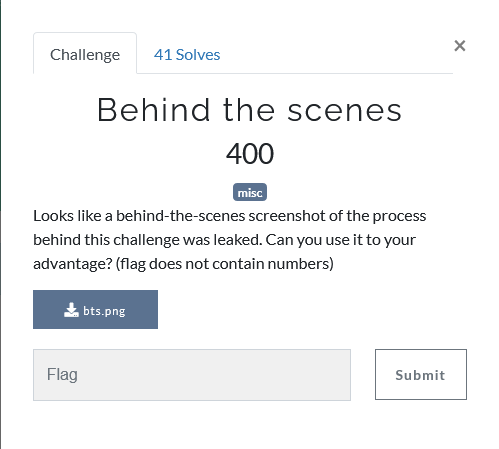
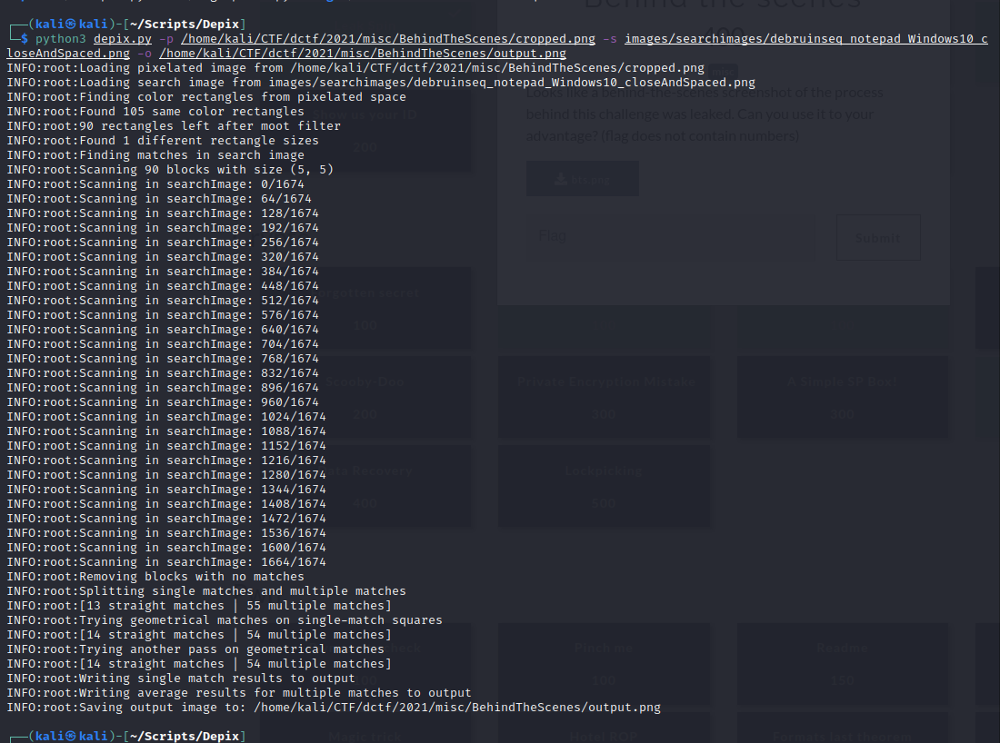
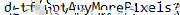

## Description

<p align="center">

</p>

## Solution

<p align="center">

</p>

After download the picture, we inspect the picture but we quickly notice there is a password that is pixelated at the middle of the picture.

There is one tool that can  help to decrypt which is [Depix](https://github.com/beurtschipper/Depix)

but before we can decode it we need to crop the picture to pixel perfect pixelated picture like shown below.

<p align="center">

</p>

Then, we can proceed to decrypt it

```
python3 depix.py -p /home/kali/CTF/dctf/2021/misc/BehindTheScenes/cropped.png -s images/searchimages/debruinseq_notepad_Windows10_closeAndSpaced.png -o /home/kali/CTF/dctf/2021/misc/BehindTheScenes/output.png
```
<p align="center">

</p>

Finally, we will get our decrypted flag

<p align="center">

</p>

`dctf{GotAnyMorePixels}`