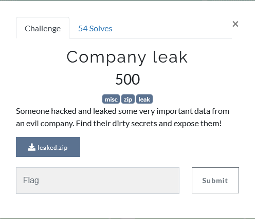
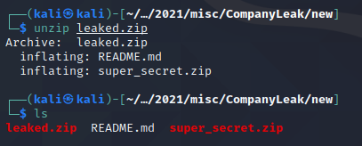
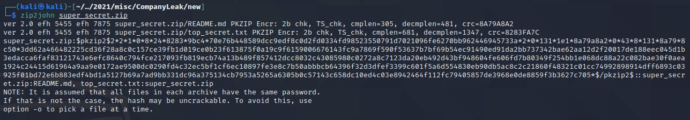
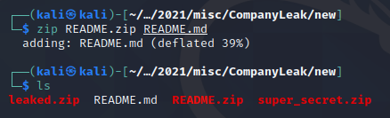
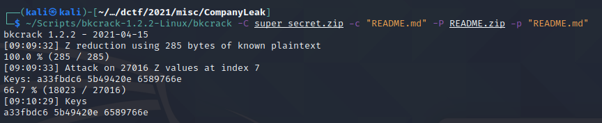
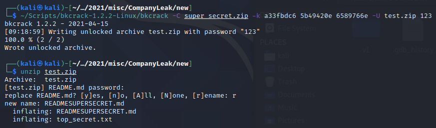
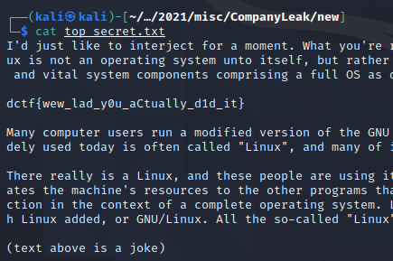

## Description

## Solution

After download the file, we will get a zip file.

If we try to unzip the zip file, we will get a README.md and another super_secret.zip.

We found out that **super_secret.zip** need a password to be able to unzip it. We tried to convert the zip to hash using zip2john but got the error output.

Upon finding some resources, we stumble across a tool called [bkcrack](https://github.com/kimci86/bkcrack) that can solve the problem.

What we need to do first is to make a zip file locally ourselves with **README.md** inside

Now we can run [bkcrack](https://github.com/kimci86/bkcrack) against it like so: `~/Scripts/bkcrack-1.2.2-Linux/bkcrack -C super_secret.zip -c "README.md" -P README.zip -p "README.md"` which tells bkcrack to target the file `README.md` inside `super_secret.zip` and a file with the same name in `README.zip` for its attack.

After finishing running the command, we will get 3 keys that we need to attack the **super_secret.zip** by creating a new zip file.

`~/Scripts/bkcrack-1.2.2-Linux/bkcrack -C super_secret.zip -k a33fbdc6 5b49420e 6589766e -U test.zip 123`

We then can unzip the newly created zip file **test.zip** with the password we passed in **123**

cat the top_secret.txt

