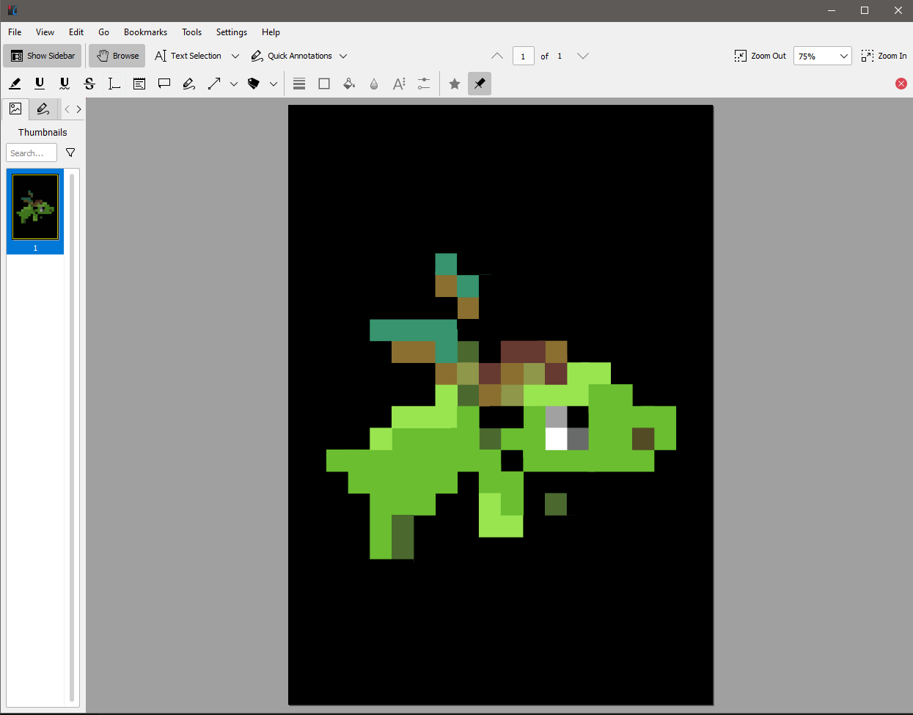

## Description

<p align="center">

</p>

## Solution

After download the pdf file we will get something like this 

<p align="center">

</p>

Just a simple pdf file contains nothing.

We can use a tool called [pdf-parser](https://en.wikipedia.org/wiki/Pdf-parser) to analyze the pdf file.

`pdf-parser dragon.pdf`

After some inspection, we found 1 object that has JS code in it.

```
obj 3 0
 Type: /Action
 Referencing: 

  <<
    /Type /Action
    /S /JavaScript
    /JS <766172205F3078346163393D5B2736363361435968594B272C273971776147474F272C276C6F67272C273150744366746D272C27313036387552596D7154272C27646374667B7064665F316E6A33637433647D272C273736383537376A6868736272272C2737313733343268417A4F4F51272C27373232353133504158436268272C2738333339383950514B697469272C27313434373836335256636E546F272C2731323533353356746B585547275D3B2866756E6374696F6E285F30783362316636622C5F3078316164386237297B766172205F30783536366565323D5F3078353334373B7768696C652821215B5D297B7472797B766172205F30783237353061353D7061727365496E74285F307835363665653228307831366529292B2D7061727365496E74285F307835363665653228307831366429292B7061727365496E74285F307835363665653228307831366329292B2D7061727365496E74285F307835363665653228307831373329292A2D7061727365496E74285F307835363665653228307831373129292B7061727365496E74285F307835363665653228307831373229292A2D7061727365496E74285F307835363665653228307831366129292B7061727365496E74285F307835363665653228307831366629292A7061727365496E74285F307835363665653228307831373529292B2D7061727365496E74285F307835363665653228307831373029293B6966285F30783237353061353D3D3D5F307831616438623729627265616B3B656C7365205F30783362316636625B2770757368275D285F30783362316636625B277368696674275D2829293B7D6361746368285F3078353736346134297B5F30783362316636625B2770757368275D285F30783362316636625B277368696674275D2829293B7D7D7D285F3078346163392C3078386439376629293B66756E6374696F6E205F30786128297B766172205F30783363366432303D5F3078353334373B636F6E736F6C655B5F3078336336643230283078313734295D285F307833633664323028307831366229293B7D76617220613D27626B706F646E746A636F7073796D6C78656977686F6E7374796B787372707A79272C623D2765787262737071717573746E7A717269756C697A70656565787771736F666D77273B5F30786228612C62293B66756E6374696F6E205F307835333437285F30783337646533352C5F3078313961633236297B5F30783337646533353D5F30783337646533352D30783136613B766172205F30783461633965613D5F3078346163395B5F30783337646533355D3B72657475726E205F30783461633965613B7D66756E6374696F6E205F307862285F30783339623365652C5F3078666165353433297B766172205F30783235393932333D5F30783339623365652B5F30786661653534333B5F30786128293B7D0A>
  >>
```

Put the string to [cyberchef](https://gchq.github.io/CyberChef/) and decrypt it.

<p align="center">

</p>


Got flag :)