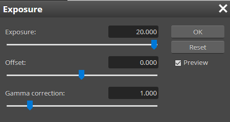

## Description

## Solution

### Method 1

We can use a tool called [stegsolve](https://github.com/zardus/ctf-tools/tree/master/stegsolve) and choose **Blue Pane 0**

### Method 2

Go google **online photoshop** and simply choose any of the links

Then we can choose Exposure and make it 100%

