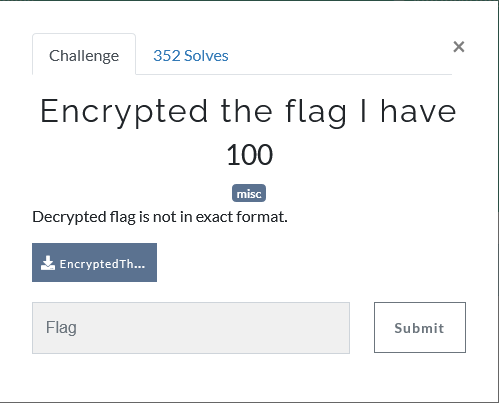

## Description

## Solution

After download the file, we got some encryption image like this 

If you are a Star Wars fans, you should know this :)

The encryption is called Aurebesh.

Follow the symbol to decrypt and you will get the flag.

