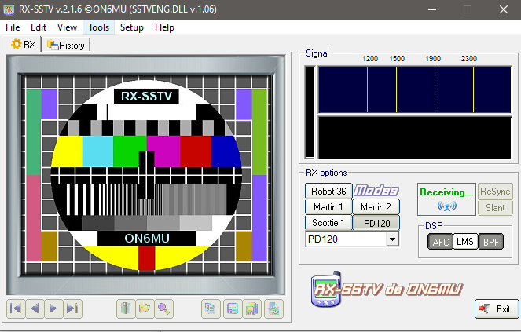

## Description

## Hint

## Solution

This is a picture transmission method called Slow-scan television (SSTV)

We can use a tool called [RX-SSTV](http://users.belgacom.net/hamradio/rxsstv.htm) to scan it to produce the image

This is the flag :P

