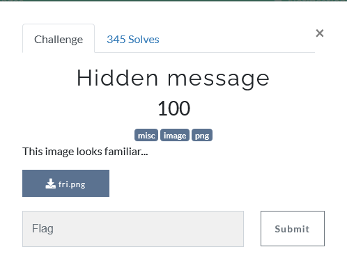
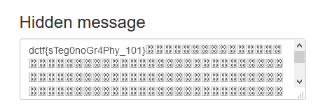

## Description

## Solution

After download the image and open it, we can see this image, nothing special just an image.

If we use tool online for example like this one [Steganography Online](https://stylesuxx.github.io/steganography/) we can decode and get the flag

