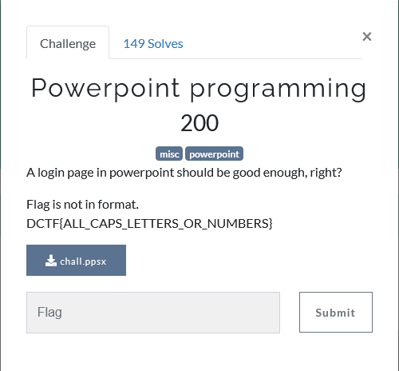
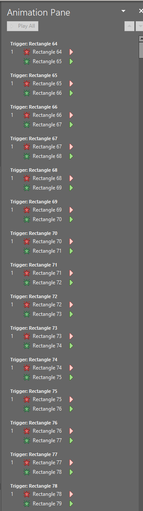
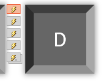

## Description

## Solution

We got a ppsx file that will require us to enter flag and submit

> We mostly will get wrong answer anyway.

We converted the file to pptx to get the editing tab

Then navigate to Animation tab

We can see there are some animation being put to some of the alphabet and symbol

**In fact that is the flag.**

Follow the animation pane trigger order to get the flag

Do notice that when click on the key let say **Rectangle 64**, the animation icon will lid up meaning this is the character of the flag.

