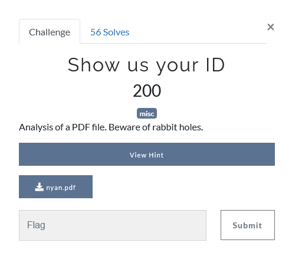
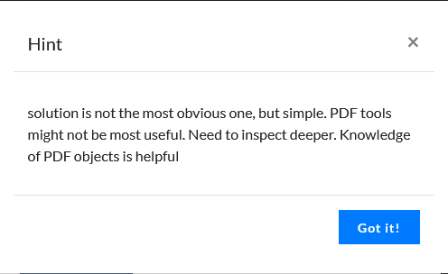
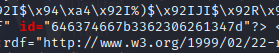
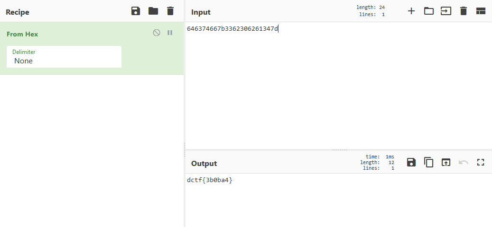

## Description

## Hint

## Solution

Same thing as [Don't let it Run](https://github.com/CHOOCS/CTF-Writeups/tree/master/DCTF/2021/misc/DontLetItRun) challenge, after download the pdf and we will run [pdf-parser](https://en.wikipedia.org/wiki/Pdf-parser) to analyze the object.

After some inspection, nothing special shows up.

But, there is a parameter in this tool which is `-c`

> -c - display the content for objects without streams or with streams without filters

`pdf-parser -c nyan.pdf`

After running this command we will get all the info of the objects without stream.

Since the title of the challenge says show us your id, we might as well try to grep the id out

`pdf-parser -c nyan.pdf | grep id=`

`id="646374667b3362306261347d"`

We got the ID, we can put the value to [cyberchef](https://gchq.github.io/CyberChef) to decrypt it

