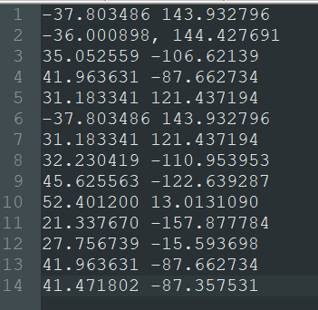
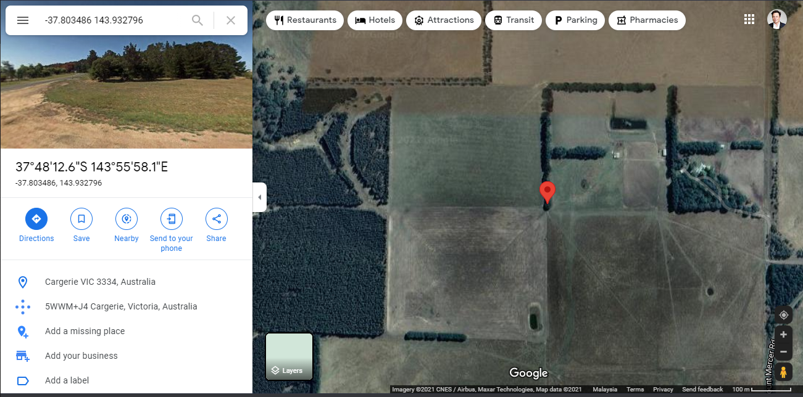
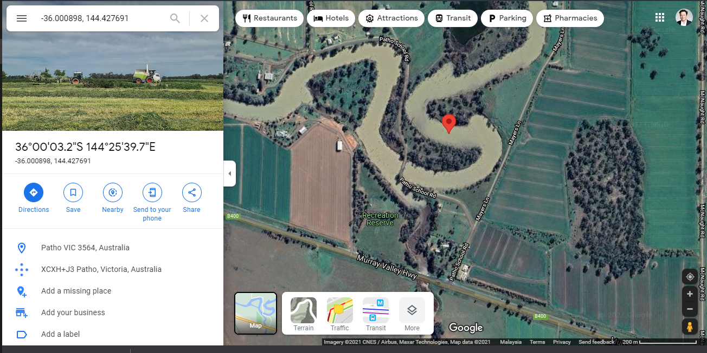

## Solution

After decoding the file using the password fscyber, we will get a text file containing these coordinates.

We then can put it to the google map and turn on the satellite layer.

We can see the first word is **F**

Second word is an **S**

And we can keep decoding it.

Soon, we can get the flag and change it to lower case.

Flag: **fsgeofontcyber**