## Solution

After unzip the file using the password **fscyber**, you will get a PHP file named **Loki.php**

After we open the file, we can see there is a bunch of obfuscated code inside the file.

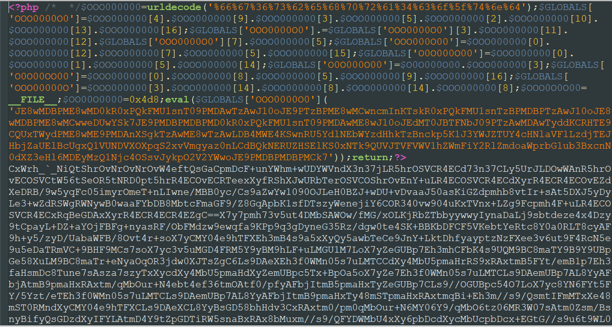

We can first put this code to a code beautifier [Code Beautifier](https://codebeautify.org/php-beautifier)

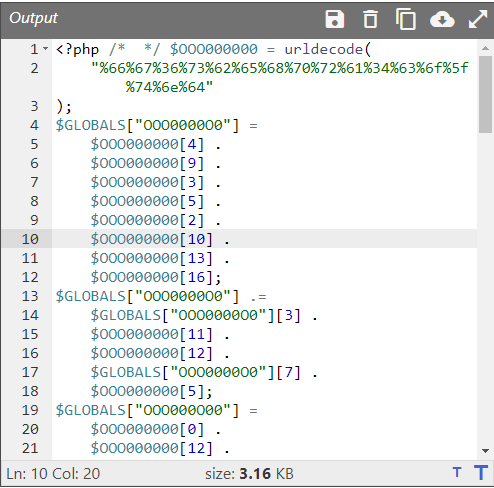

We will get the code much more cleaner and we still have job to be done.

First, we can see the function **urldecode**, which we can put the URL encoded string to [Cyberchef](https://gchq.github.io/CyberChef/) to decode it.

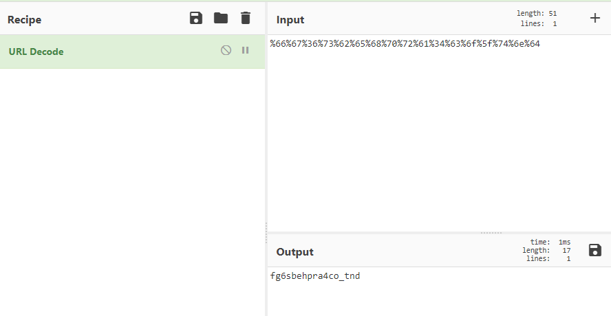

We get a string here. We might as well replace it to the code.

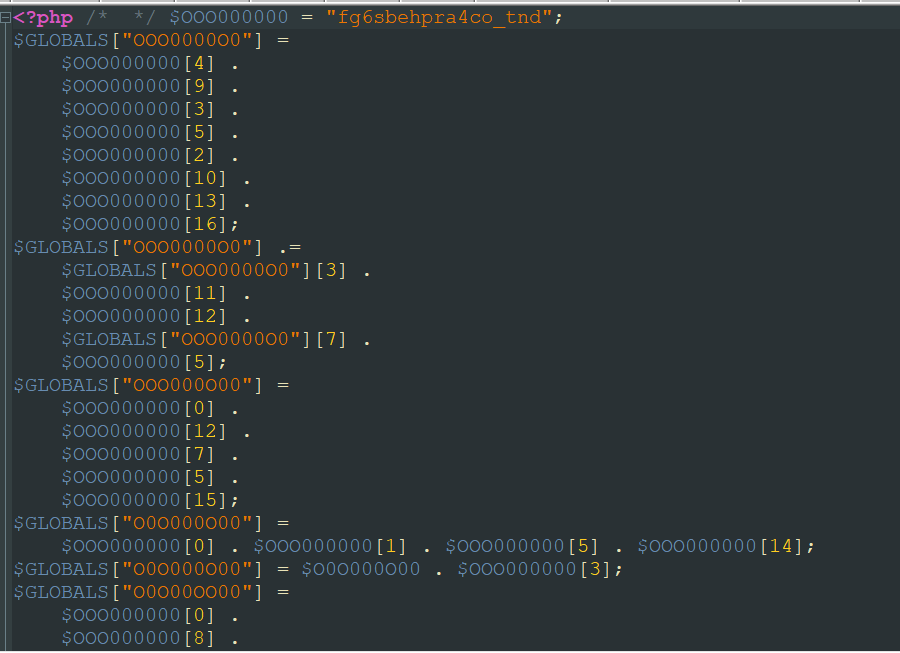

We can see here bunch of variables and this is actually a string is made up with each element of the string above.

We can further split the character of each string to an array element.

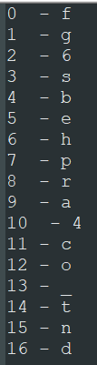

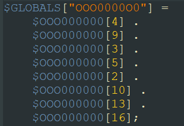

If we take this to decode, **[4]** would be the character **b**, **[9]** would be character **a**

We will get something like this at the end.

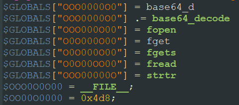

Moving on, we can see a piece of code that wrap with an eval function. I knew it was gonna be base64 encoded.

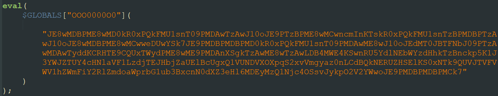

Use cyberchef to decode again.

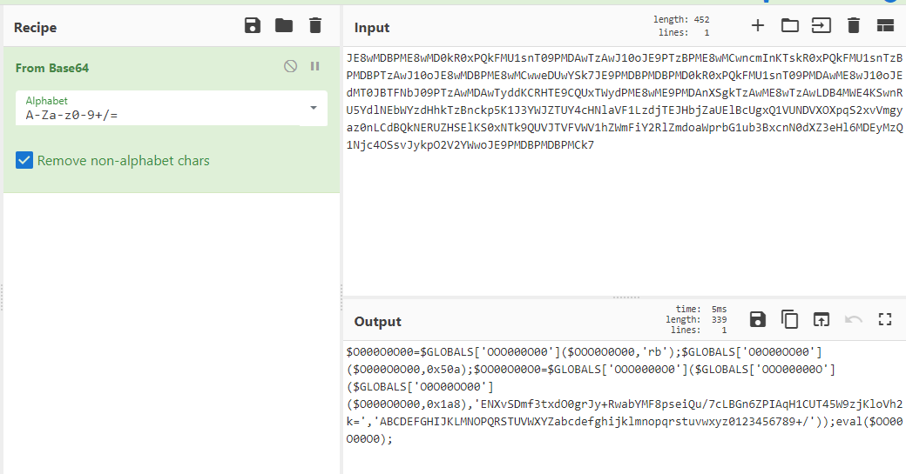

Walla, another piece of code. Replace the old code again.

After that, in notepad, if you double click any of the variables, you will see any string that has the same name will highlight at the same time.

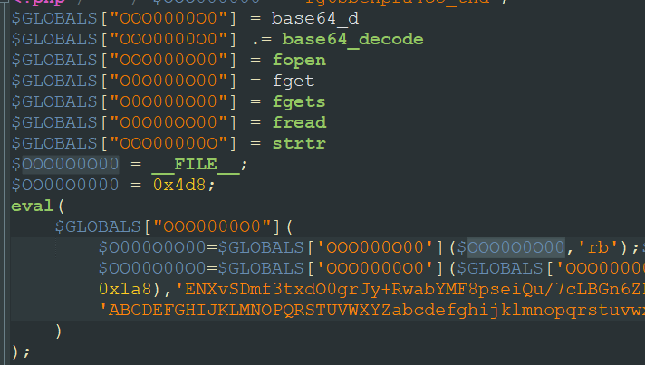

We can further replace it like this

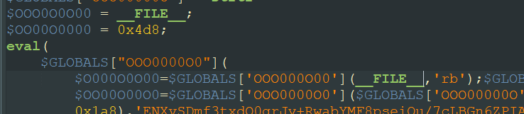

The result we get after we replace all of the functions and necessary strings.

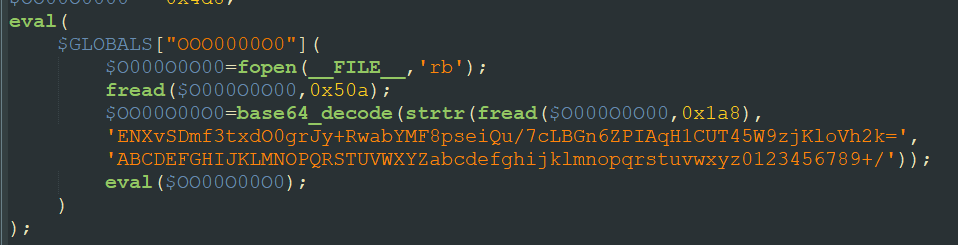

We can see from this code actually it read the **\_\_FILE\_\_** and use **strtr** function to replace the string.

Further information can read here:

[strtr()](https://www.w3schools.com/PHP/func_string_strtr.asp)

[base64_decode()](https://www.geeksforgeeks.org/php-base64_decode-function/)

[fread()](https://www.w3schools.com/php/func_filesystem_fread.asp)

We can see this string at the bottom of the code file.

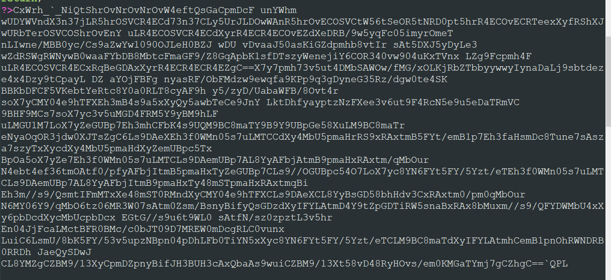

`strtr(fread($O000O0O00,0x4d8),'ENXvSDmf3txdO0grJy+RwabYMF8pseiQu/7cLBGn6ZPIAqH1CUT45W9zjKloVh2k=','ABCDEFGHIJKLMNOPQRSTUVWXYZabcdefghijklmnopqrstuvwxyz0123456789+/')`

We then can replace the **fread** function with the string above then further use **base64** to decode the string.

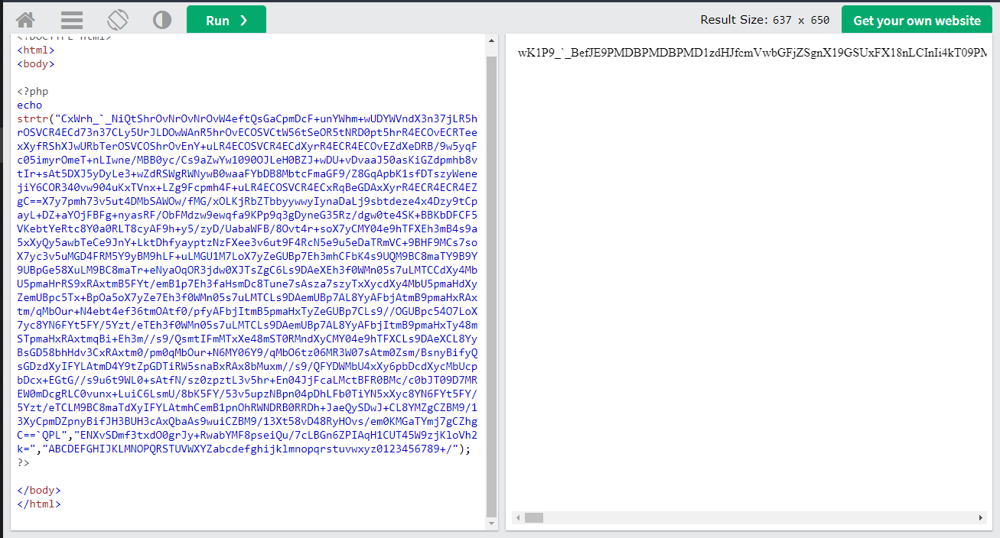

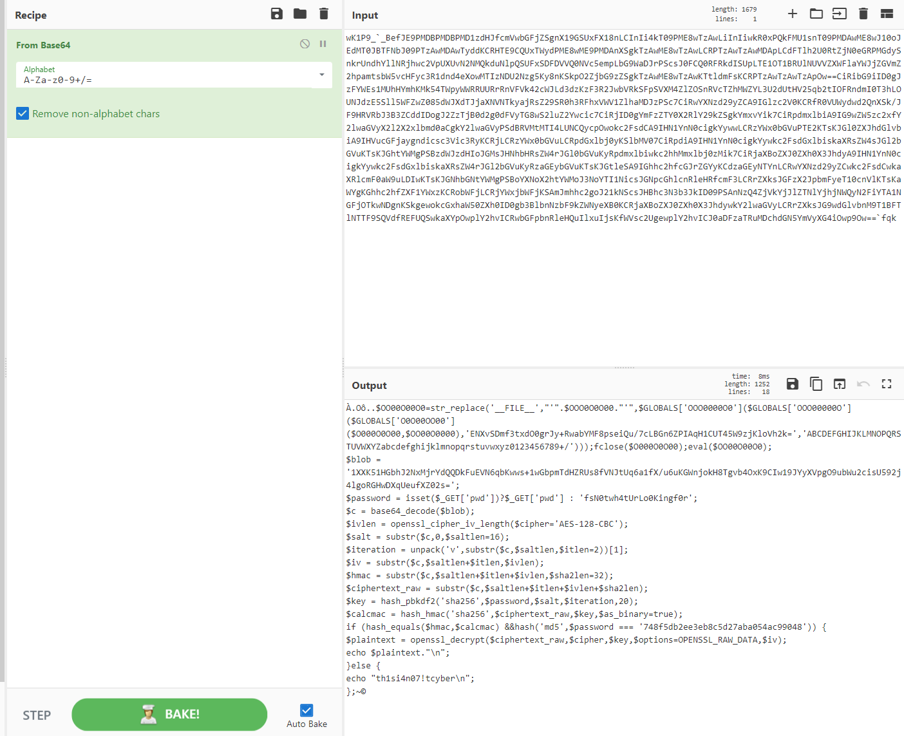

We can see we get another piece of code.

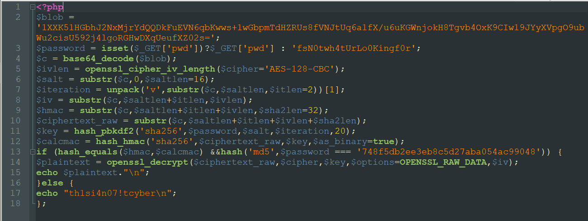

If we further analyze this, we can know that this is an AES-128-CBC type of encryption.

What we need now is the password, and we can see it at the line 13  of the code, we can see that if the password md5 hash is equal with the hash then proceed with the decryption.

What I would do first is get the password from the [CrackStation](https://crackstation.net/) and copy the code to the online compiler.

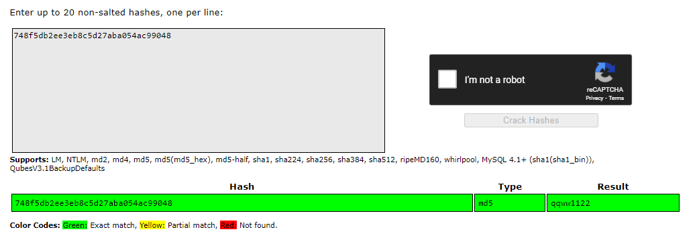

Password is **qqww1122**

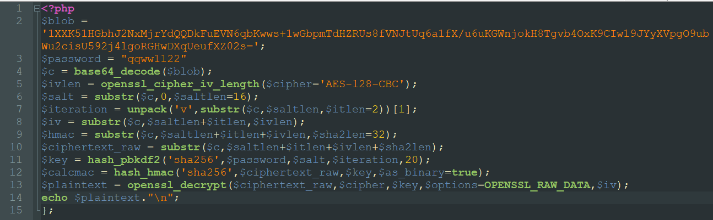

And we can remove the if statement and proceed to the decryption since we already know the password.

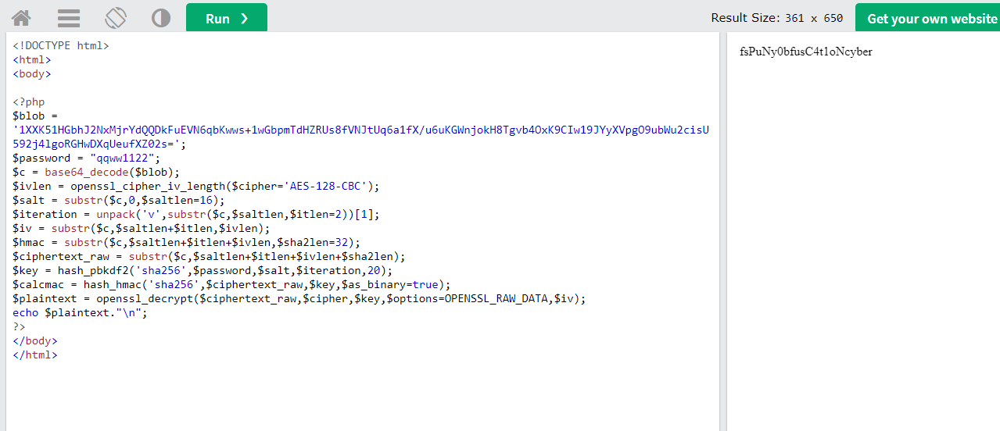

Got the flag !

Congratz!