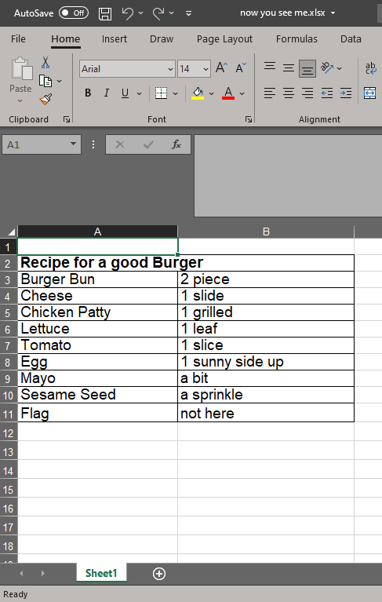
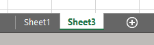
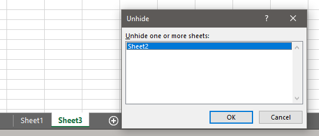
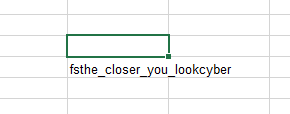

## Solution

After download the file, it was a Microsoft Excel file.

Open the file, it looks something like this.

Nothing special.

When we click the **+** button, we can see that it goes to **Sheet 3**, skipping **Sheet 2**

What we can do is unhide **sheet 2**.

We then can further use Control + F to find the flag using the flag format **fs** or **cyber** keyword

Got the flag!