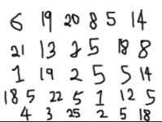
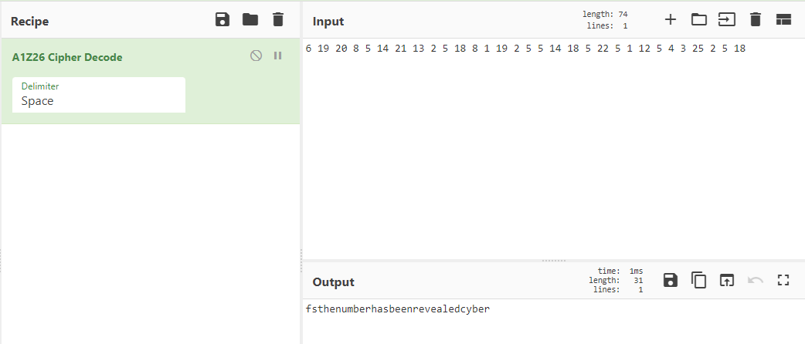

## Solution

Decode the file using the password **fscyber**

You will get a picture like this.

This encryption is called A1Z26

Put into [CyberChef](https://gchq.github.io/CyberChef) and decode it.

