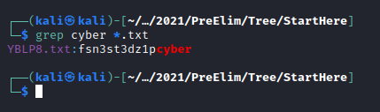

## Solution

After you decode the file with the password **fscyberx**, you will get a file call **starthere.zip**

Using this command

```find . -name "*.zip" | while read filename; do unzip -o -d "`dirname "$filename"`" "$filename"; done;```

Then you can use the **grep** command to get the flag.

