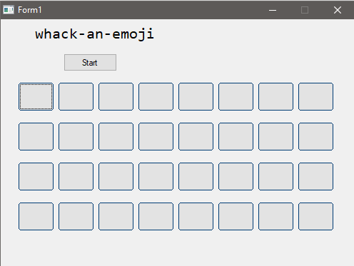
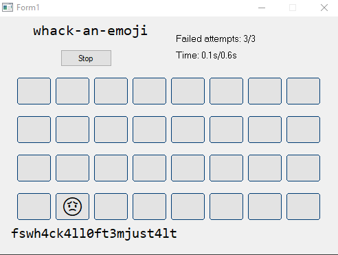
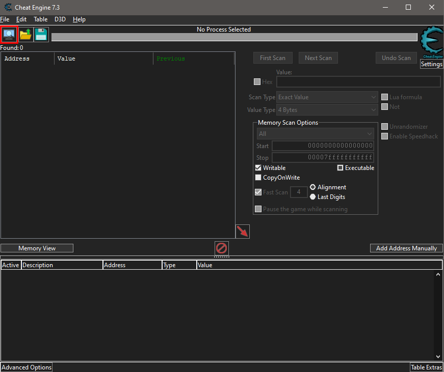
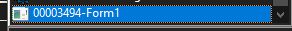
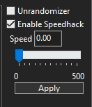
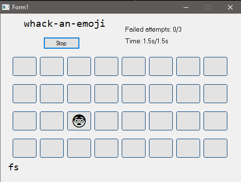
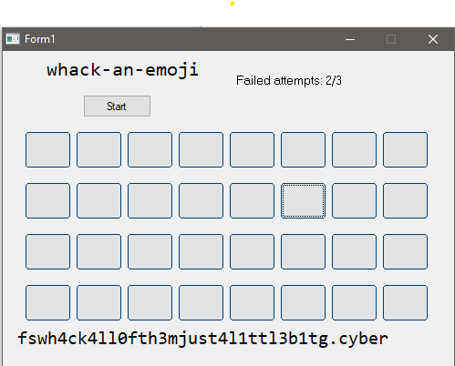

## Solution

After unzip the file, you will get a exe file.

When you click **Start** and play the game, you will find it hard to get the flag at the end.

What we can do is to use [Cheat Engine](https://cheatengine.org/) to solve the challenge. 

Download and install the Cheat Engine.

Click the upper left first icon to choose the application.

Choose this application (Follow the window name)

Then, tick the **Enable Speedhack** and decrease the speed to 0 and click **Apply**

You will notice that the time does not goes down.

Start clicking the emoji and get the flag.

